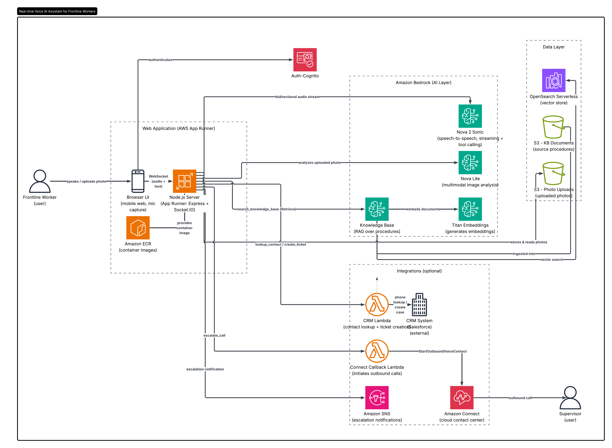

# Voice AI Assistant for Frontline Workers

**A real-time, voice-to-voice AI assistant built with Amazon Nova 2 Sonic, Bedrock Knowledge Bases, and pluggable CRM / contact-center integrations**

---

## Why This Repo Exists

Frontline workers — store clerks, field technicians, warehouse staff, front-desk agents — hit dozens of edge cases a day. The answer is usually buried in a manual nobody has time to read, or it means stopping work to call a manager.

This project is a **voice-first AI assistant** they can simply *talk to*. It pulls answers from a knowledge base of your own procedures, files support tickets in your CRM, analyzes photos of equipment or products, and escalates to a supervisor with a real phone call — all from a phone browser, hands-free.

It started as an industry-specific demo and was generalized into a **reusable accelerator**. Everything that ties it to a particular company or industry lives in a single config file and a `.env`, so you can adapt it to your own use case without touching the core code.

This repo documents:

- **What it does** — a working voice assistant powered entirely by AWS services
- **How the pieces fit together** — Nova 2 Sonic + RAG + tool calling + your backend systems
- **Every gotcha I solved** — stream event ordering, speculative-text deduplication, silence keepalives, SDK migrations, and WebSocket-through-App-Runner issues

The architecture applies to **any industry** where a frontline worker needs hands-free access to knowledge and actions.

---

## What It Does

A worker opens the web app on their phone and can:

1. **Talk to the assistant** — natural voice conversation, no typing required (responds in the user's language)
2. **Get procedure guidance** — the assistant searches a knowledge base and answers conversationally (RAG)
3. **Upload a photo** — snap a picture of broken equipment or a damaged item; the assistant analyzes it and responds by voice
4. **Create a CRM ticket** — the assistant looks up the worker by phone, then files a support case
5. **Escalate to a supervisor** — the assistant triggers an outbound phone call via Amazon Connect

Everything happens in one continuous voice conversation. Works in **demo mode out of the box** — CRM and Connect integrations are optional.

---

## Architecture Overview


*Complete AWS architecture — voice/photo/text from a phone browser flows through App Runner, Amazon Nova 2 Sonic, a Bedrock Knowledge Base, and pluggable CRM / Amazon Connect integrations.*

```
                          ┌──────────────────────────┐
   Worker (phone) ───────▶│   Web App (App Runner)    │
   voice + photo + text   │   Node.js + Socket.IO     │
                          └────────────┬──────────────┘
                                       │ bidirectional stream
                                       ▼
                          ┌──────────────────────────┐
                          │   Amazon Nova 2 Sonic     │
                          │  (speech-to-speech +      │
                          │   tool calling)           │
                          └────────────┬──────────────┘
                                       │ tool calls
          ┌────────────────────────────┼────────────────────────────┐
          ▼                ▼                       ▼                  ▼
 ┌────────────────┐ ┌──────────────┐    ┌──────────────────┐ ┌──────────────┐
 │search_knowledge│ │lookup_contact│    │  create_ticket   │ │escalate_call │
 │_base (Bedrock  │ │  (CRM)       │    │     (CRM)        │ │Amazon Connect│
 │KB + OpenSearch)│ └──────────────┘    └──────────────────┘ └──────────────┘
 └────────────────┘

 Photo upload ─▶ S3 ─▶ Nova Lite (multimodal) ─▶ description ─▶ Nova Sonic reads it aloud
```

More diagrams (per-layer detail and step-by-step flows) live in [`docs/architecture/`](docs/architecture/).

---

## How It Works

1. **Worker speaks** — the browser captures microphone audio (16kHz PCM) and streams it over WebSocket
2. **Server bridges to Bedrock** — maintains a bidirectional stream with Nova 2 Sonic, forwarding audio both ways
3. **AI orchestration** — Nova 2 Sonic transcribes, reasons, and decides when to call a tool
4. **Tools execute** — the server runs the requested tool (KB search, CRM lookup/create, Connect callback) and returns the result
5. **Natural response** — Nova 2 Sonic speaks the answer back in real time, with on-screen transcription

---

## Project Structure

| Path | Description |
|------|-------------|
| `webapp/src/config.ts` | **All branding, prompts, and personalization** — driven by env vars |
| `webapp/src/server.ts` | Express + Socket.IO server, photo analysis, `/api/config` endpoint |
| `webapp/src/client.ts` | Nova 2 Sonic bidirectional streaming client |
| `webapp/src/tools.ts` | 4 AI tools: search_knowledge_base, lookup_contact, create_ticket, escalate_call |
| `webapp/src/consts.ts` | Model IDs, tool schemas, audio config |
| `webapp/public/` | Mobile-first UI (branding loaded dynamically from `/api/config`) |
| `webapp/Dockerfile` | Container build for App Runner |
| `kb-content/` | Sample knowledge base documents (replace with your own) |
| `lambda/connect-callback/` | Amazon Connect outbound-call Lambda (env-driven) |
| `scripts/` | Deployment helpers (Knowledge Base, OpenSearch index, App Runner) |

---

## Quick Start (Local, Demo Mode)

```bash
cd webapp
npm install
cp .env.template .env        # set AWS_REGION and KNOWLEDGE_BASE_ID
npm run dev                  # http://localhost:3000
```

You need AWS credentials with access to Bedrock (Nova 2 Sonic + Nova Lite) and a Bedrock Knowledge Base. CRM and Connect integrations are optional — without them the assistant runs in demo mode.

---

## Customize for Your Industry

Everything industry-specific is configurable via environment variables — no code changes:

```bash
ASSISTANT_NAME="Field Support"
BRAND_NAME="ACME"
BRAND_COLOR="#0F62FE"
ACCENT_COLOR="#FFB000"
GREETING="Hey! 👋"
VOICE_ID="matthew"
SUGGESTIONS="🔧|Equipment issue|Diagnose a fault;;📋|Log a job|Create a work order;;📞|Call dispatch|Reach a supervisor"
# Optional: override the whole system prompt
SYSTEM_PROMPT="You are a field-service assistant for technicians..."
```

Then replace the documents in `kb-content/` with your own procedures and sync them to your Knowledge Base.

**Example adaptations:** field service, healthcare, logistics, hospitality, retail, telecom.

---

## AWS Services Used

| Service | Purpose |
|---------|---------|
| Amazon Nova 2 Sonic | Real-time speech-to-speech + tool calling |
| Amazon Nova Lite | Multimodal image analysis |
| Amazon Bedrock Knowledge Bases | RAG over your procedures |
| OpenSearch Serverless | Vector store for the knowledge base |
| Amazon Titan Embeddings | Document embeddings |
| AWS App Runner | Containerized web app hosting with automatic HTTPS |
| Amazon ECR | Docker image registry |
| Amazon S3 | Photo storage + knowledge base documents |
| AWS Lambda | CRM integration + Connect callback |
| Amazon Connect | Outbound voice callback to supervisors (optional) |
| Amazon SNS | Escalation notifications (optional) |

---

## Voices

Amazon Nova Sonic supports multiple voices. Set `VOICE_ID` in `.env`:

| Voice ID | Language |
|----------|----------|
| `matthew`, `tiffany` | English (US) |
| `amy` | English (UK) |
| `lupe`, `carlos` | Spanish |
| `ambre`, `florian` | French |
| `beatrice`, `lorenzo` | Italian |
| `greta`, `lennart` | German |

---

## Gotchas Solved

Things that cost hours and aren't obvious from the docs:

- **Nova 2 Sonic event ordering** — `sessionStart` → `promptStart` → `systemPrompt` → `audioStart` must be queued in exact order *before* the stream opens
- **Tool schema format** — `inputSchema.json` must be a **stringified** JSON, not an object
- **Speculative vs Final text** — Nova Sonic emits each response twice (a real-time `SPECULATIVE` pass and a `FINAL` pass); render only one to avoid duplicate bubbles
- **55-second timeout** — the stream dies without audio; send silence frames every 200ms when the user is on text mode
- **Node 18 Lambda runtime** — `aws-sdk` v2 is gone; use `@aws-sdk/client-*` v3
- **WebSocket through App Runner** — have Socket.IO use `polling` first, then upgrade to `websocket`

---

## Deploy to AWS

See `scripts/` for parameterized deployment helpers:

1. Create an OpenSearch Serverless collection + vector index (`create-opensearch-index.py`)
2. Create the Bedrock Knowledge Base and sync your docs (`create-knowledge-base.sh`)
3. Build, push, and deploy the web app to App Runner (`deploy-apprunner.sh`)

Copy `scripts/deploy.env.template` to `scripts/deploy.env` and fill in your values first.

---

## License

MIT

## Built With

Designed and built end-to-end as a Solution Architect accelerator, pair-programmed with Kiro (AI IDE).
