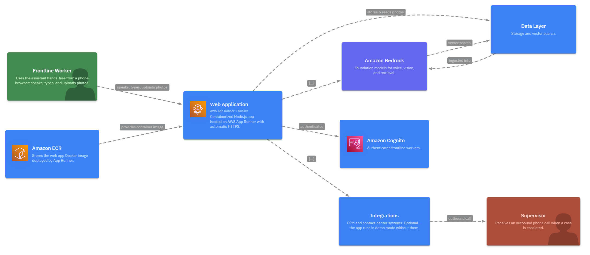
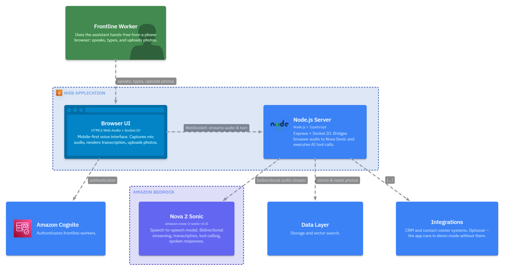
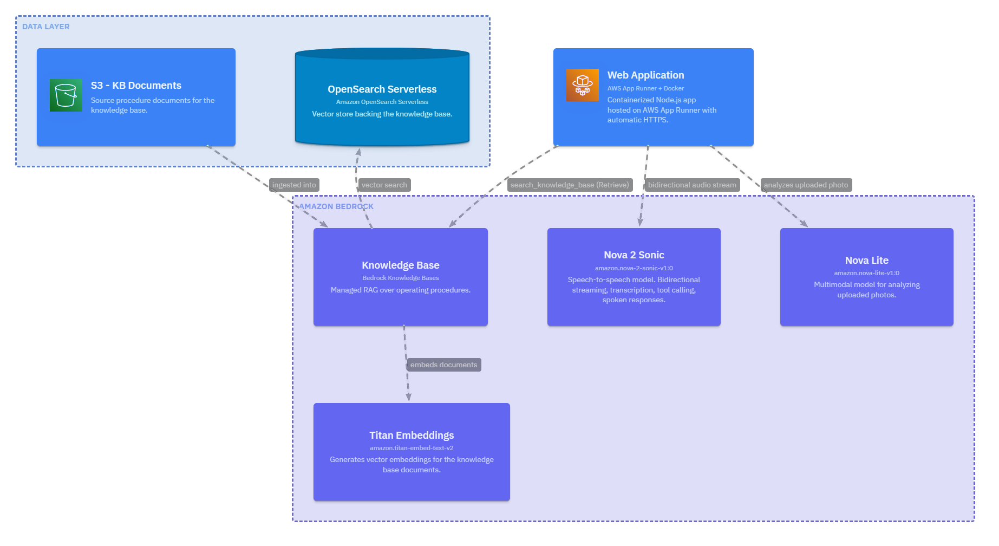
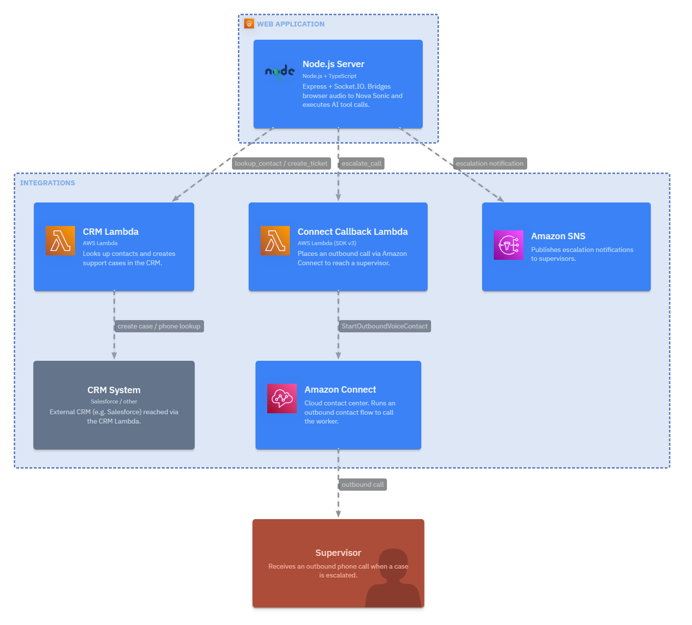
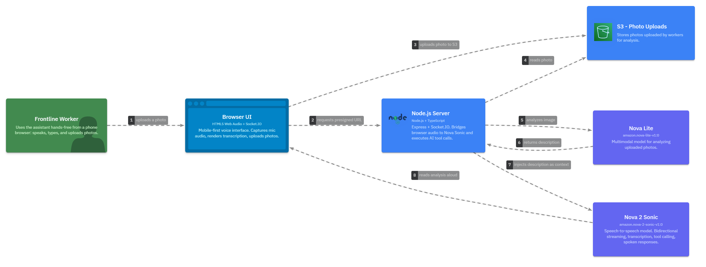
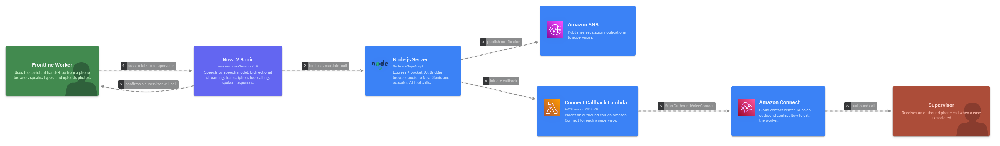

# Architecture Diagrams

Architecture for the Voice AI Assistant. The diagrams below are the canonical reference (created in Lucidchart with official AWS icons). A [LikeC4](https://likec4.dev) model is also included as code in [`voice-ai-assistant.c4`](./voice-ai-assistant.c4) for versioned, regenerable views.

## Complete Architecture


The full picture: a frontline worker interacts (voice, text, photo) with the web app on AWS App Runner. The Node.js server bridges audio to Amazon Nova 2 Sonic, which orchestrates four tools — knowledge base search (Bedrock KB + OpenSearch), CRM lookup/ticket creation, and supervisor escalation via Amazon Connect. Photos are analyzed by Nova Lite.

## Landscape



High-level view of the systems and how they connect.

## Per-Layer Detail

### Web Application


### Amazon Bedrock (AI Layer)


### Integrations (CRM & Contact Center)


## Interaction Flows

### Photo Analysis Flow


### Escalation Flow


---

## Regenerating Diagrams from Code (LikeC4)

The `.c4` model can render all views and export to PNG/SVG/draw.io. Run through WSL:

```bash
cd docs/architecture
npx likec4 serve .          # interactive preview at http://localhost:5173
npx likec4 export png -o ./images .   # requires: npx playwright install
```

Available views: `index`, `fullArchitecture`, `webappDetail`, `bedrockDetail`, `integrationsDetail`, and dynamic flows `voiceFlow`, `photoFlow`, `ticketFlow`, `escalationFlow`.
